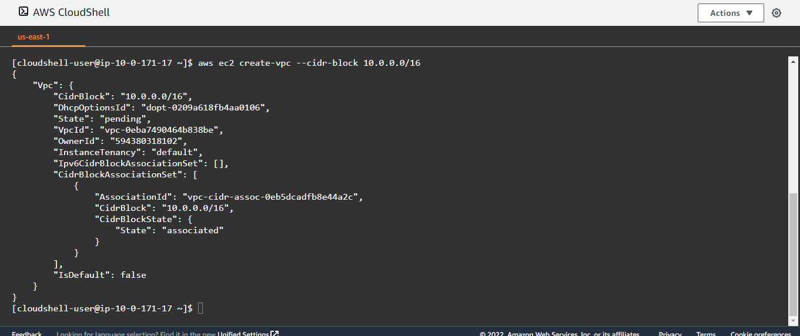
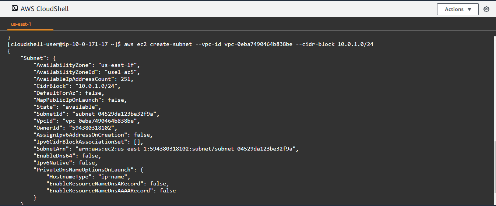
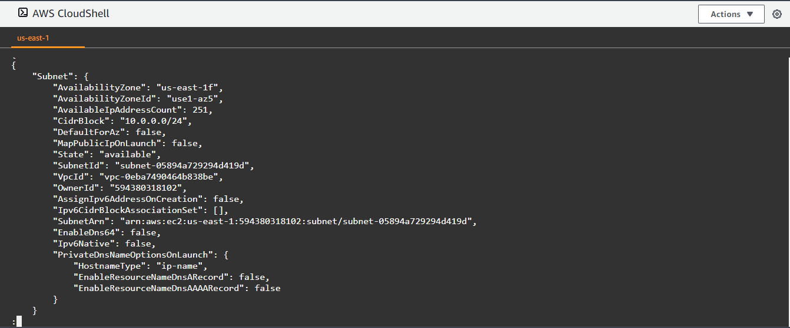
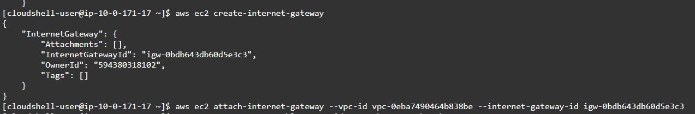
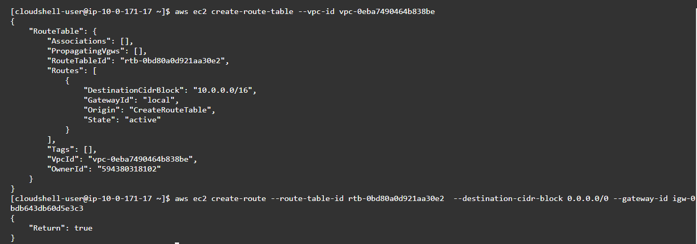
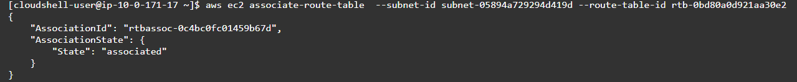

# LAB: Working with Amazon CLI

## Task:

Create a VPC with the following property using the CLI:

1.  Name: LabVPC
2.  CIDR block 10.0.0.0/16
3.  Two subnets (one private with 10.0.1.0/24 and one public  10.0.0.0/24)
4.   Attach an internet gateway

## Solution:
1. I ran below code to create a vpc with CIDR block 10.0.0.0/16
    ```
    aws ec2 create-vpc --cidr-block 10.0.0.0/16

    ```

    > Here is a screenshot of the vpc created:
    

2. I created 2 subnets with vpc-id in the previous step 
    ```
    aws ec2 create-subnet --vpc-id vpc-0eba7490464b838be --cidr-block 10.0.1.0/24
    aws ec2 create-subnet --vpc-id vpc-0eba7490464b838be --cidr-block 10.0.0.0/24

    ```

    > Here is the screenshots of the subnets created:
    
    

3. I created an internet gateway and attach it to my vpc from the previous steps
    ```
    aws ec2 create-internet-gateway
    aws ec2 attach-internet-gateway --vpc-id vpc-0eba7490464b838be --internet-gateway-id igw-0bdb643bdb643db605e3c3

    ```
    > Here is the screenshots of the subnets created:
    

4. I created route table for the VPC in previous steps and create a route that point all traffic to gateway created earlier.
    ```
    aws ec2 create-route-table --vpc-id vpc-0eba7490464b838be
    aws ec2 create-route --route-table-id rtb-obd80a0d921aa3032 --destination-cidr-block 0.0.0.0/0 --gateway-id 0bdb643bdb643db605e3c3

    ```
    > Here is the screenshot of the routetable created:
    

5. I made the second subnet from previous steps public by associating it with the route table I created earlier
    ```
    aws ec2 associate-route-table  --subnet-id subnet-05894a729294d419d --route-table-id rtb-obd80a0d921aa3032

    ```
    > Here is the screenshot of the associated subnet:
    


Grading tip:  Screenshot each step and upload with your step by step answer


Guide:
https://docs.aws.amazon.com/vpc/latest/userguide/vpc-subnets-commands-example.html

