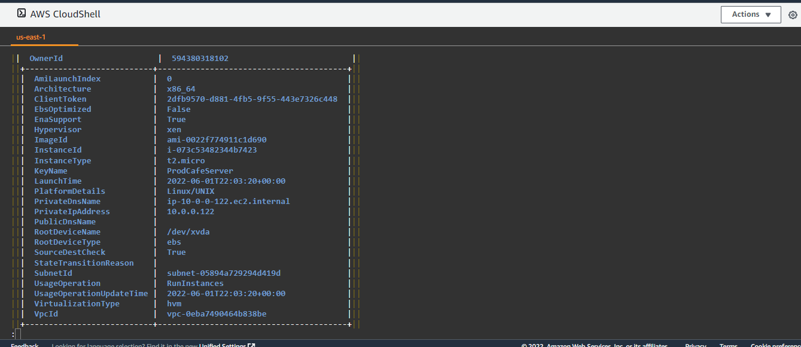

## Launch an Amazon linux instance using AWS CLI

Tasks:

Launch an instance with the following property 
1. instance OS   - Amzon linux
2. instance type - t2.micro
3. Region: Oregon
4. Network: Lab VPC, Public Subnet
5. Tag:  Key: Name     Value: ProdCafeServer
6. Security Group:  Create a  one named serverSG, with TCP port 22 and port 80 open to anywhere


Hint: Associate an elastic ip with this instance, you will need it in later lab.


## Solution

1. I created a security group named serverSG, associate it with my earlier VPC  and open TCP port 22 and port 80 to anywhere
    ```
    aws ec2 create-security-group --group-name serverSG --description "security for accessing lab instances" --vpc-id vpc-0eba7490464b838be
    aws ec2 authorize-security-group-ingress --group-id sg-007661494960295d5 --protocol tcp --port 22 --cidr 0.0.0.0
    aws ec2 authorize-security-group-ingress --group-id sg-007661494960295d5 --protocol tcp --port 80 --cidr 0.0.0.0
    ```

    > Here is the screenshots shown when I run aws ec2 describe-security-groups:
    

2. I created an Amazon Linux AMI with t2.micro type with the VPC and subnet created in the previous lab and using ProdCafeServer keypair. I copied AMI id from the Console
    ```
    aws ec2 run-instances --image-id ami-0ca285d4c2cda3300 --count 1 --instance-type t2.micro --key-name ProdCafeServer --security-group-ids sg-007661494960295d5 --subnet-id subnet-05894a729294d419d
    ```

    > Here is the screenshots of the instance property using the aws ec2 describe command:
    
    

3. I allocated an IP address from the AWS console and associate it to my launched instance

    > Here is the screenshots elastic IP console:
    
        


Grading tip:  Screenshot major cli output and upload with your step by step answer (AWS describe command can help)


Guide:

https://docs.aws.amazon.com/cli/latest/userguide/cli-services-ec2-instances.html
