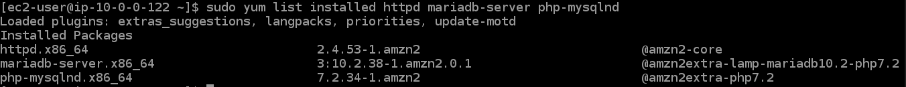
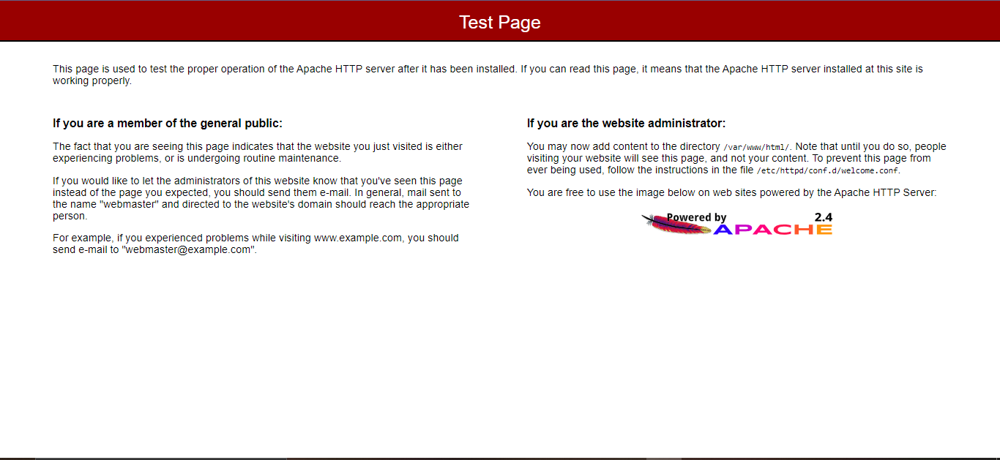
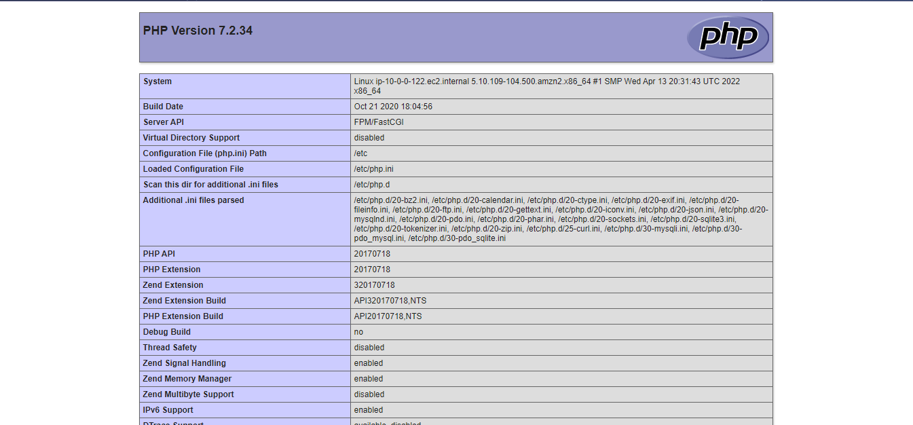
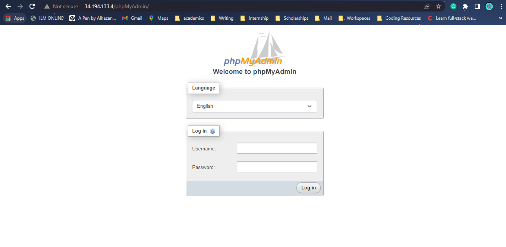

## Install a LAMP web server on Amazon Linux

Tasks:

1. Prepare the LAMP server
2. Test your LAMP server
3. Secure the database server
4. Install phpMyAdmin

## Solution

1. I connect to my launched instance using the ec2 instance connect. I install updates, and installed php, MariaDB, and apache webserver

    ```
        sudo yum update -y
        sudo amazon-linux-extras install -y lamp-mariadb10.2-php7.2 php7.2
        sudo yum install -y httpd mariadb-server
    ```

    > Here is the screenshots of all the installed packages :
    

2. I start and enable my apache webserver

    ```
        sudo systemctl start httpd
        sudo systemctl enable httpd
    ```

    > Here is the apache server in action :
    

3. I add my user to the apache group, change the ownership of /var/www to the apache group and allow write permission for the group

    ```
        sudo usermod -a -G apache ec2-user
        sudo chown -R ec2-user:apache /var/www
        sudo chmod 2775 /var/www && find /var/www -type d -exec sudo chmod 2775 {} \;
        find /var/www -type f -exec sudo chmod 0664 {} \;
    ```

4. I create a php file in the /var/www/html directory and then open up ipaddress/phpinfo.php to test if php is running

    ```
        echo "<?php phpinfo(); ?>" > /var/www/html/phpinfo.php
    ```

    > Here is the php information page that shows when I open up ipaddress/phpinfo.php :
    

5. I start my mariadb server and run the installation to set my password, remove anonymous account and disable remote login and test database

    ```
        sudo systemctl start mariadb
        sudo mysql_secure_installation
    ```

6. I installed all the required dependencies to run phpMyAdmin, restarted my webserver, installed phpMyAdmin and then confirm it's running ipaddress/phpMyAdmin

    ```
        sudo yum install php-mbstring php-xml -y
        sudo systemctl restart httpd
        sudo systemctl restart php-fpm
        cd /var/www/html
        wget https://www.phpmyadmin.net/downloads/phpMyAdmin-latest-all-languages.tar.gz
        mkdir phpMyAdmin && tar -xvzf phpMyAdmin-latest-all-languages.tar.gz -C phpMyAdmin --strip-components 1
        rm phpMyAdmin-latest-all-languages.tar.gz
    ```
    
    > Here is the phpMyAdmin login page that shows when I open up ipaddress/phpMyAdmin :
    


Guide: https://docs.aws.amazon.com/AWSEC2/latest/UserGuide/install-LAMP.html

Grading tip:  Screenshot major script outputs and upload with your step by step answer
