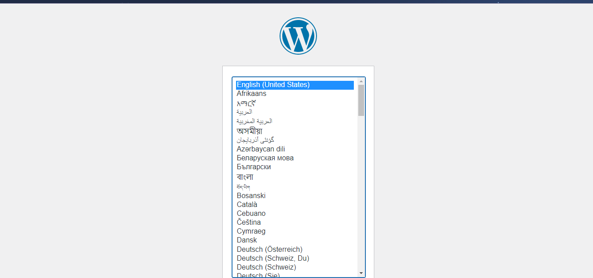

# LAB:  Host a WordPress blog on Amazon Linux 

## Task:

1. Download word press installation package.
Input this line of wget command in your shell to install wordpress 

wget https://wordpress.org/latest.tar.gz


2. Create a database user and database for your WordPress installation
3. Create and edit the wp-config.php file (use the guide
4. Install your WordPress files under the Apache document root)
5. Install the PHP graphics drawing library on Amazon Linux 2.
6. Create an AMI of this running instance.
7. Perform clean up operations.

## Solution
1. I installed the wordpress package with wget command

    ```
        wget https://wordpress.org/latest.tar.gz
        tar -xzf latest.tar.gz
    ```

2. I started my mariadb server, created a user and password for my database, created the database and grant all privileges to the just created user 

    ```
        sudo systemctl start mariadb
        mysql -u root -p
        CREATE USER 'wordpress-user'@'localhost' IDENTIFIED BY 'olajuwon';
        CREATE DATABASE `wordpress-db`;
        GRANT ALL PRIVILEGES ON `wordpress-db`.* TO "wordpress-user"@"localhost";
        FLUSH PRIVILEGES;
    ```
3. I copied wordpress config file into wp-config-sample.php, edit it using Vim and replace the database name and the keys with the one generated from wordpress [key generator](https://api.wordpress.org/secret-key/1.1/salt/)

    ```
        cp wordpress/wp-config-sample.php wordpress/wp-config.php
        vi wordpress/wp-config.php
    ```

4. I copied the contents of wordpress folder to /var/www/html and then edit httpd.conf file to allow wordpress to use permalink by changing the `AllowOveride` property to `none`

    ```
        cp -r wordpress/* /var/www/html/
        sudo vim /etc/httpd/conf/httpd.conf
    ```

5. I installed PHP graphics drawing library

    ```
        sudo yum install php-gd
    ```


6. I enable both apache and MariaDB to start on boot then open up the ipaddress to view my wordpress blog

    ```
        sudo systemctl enable httpd && sudo systemctl enable mariadb
    ```

    > Here is the wordpress that shows when I open up the ipaddress :
    

7. I create an image AMI for my running instance by using it's instance id

    ```
        aws ec2 create-image \
        --instance-id i-073c53482344b7423 \
        --name "wordpress server" 
    ```

    > Here is output of the command :
    ```
        {
            "ImageId": "ami-003cd141fdb79cc00"
        }
    ```
8. I delete my instance and release the elastic ip address from the console


Guide:
https://docs.aws.amazon.com/AWSEC2/latest/UserGuide/hosting-wordpress.html

Grading tip:  Screenshot major script/console outputs and upload with your step by step answer